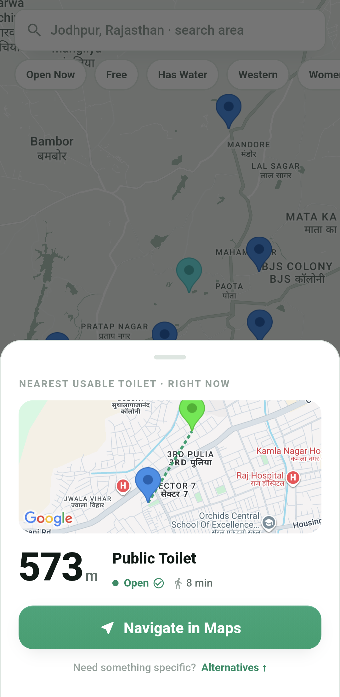
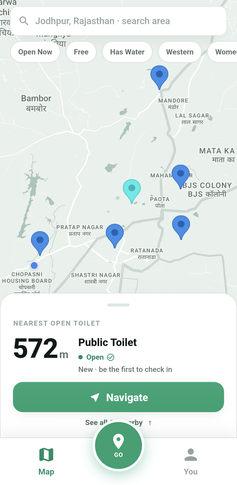
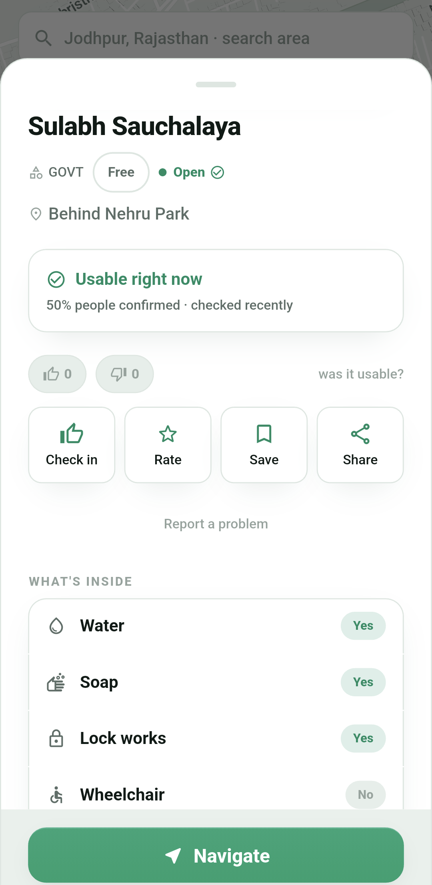
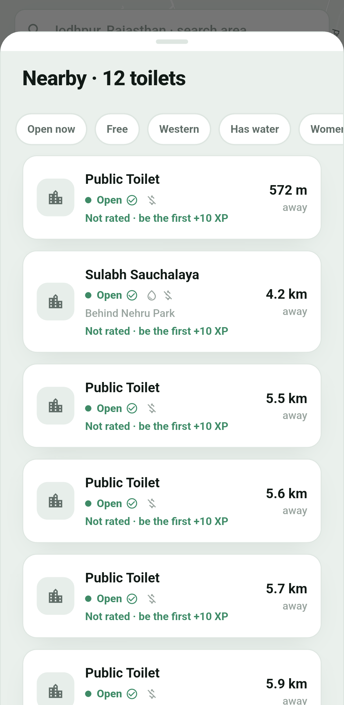
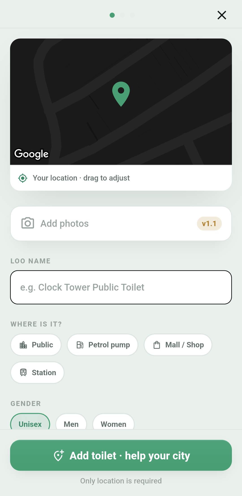
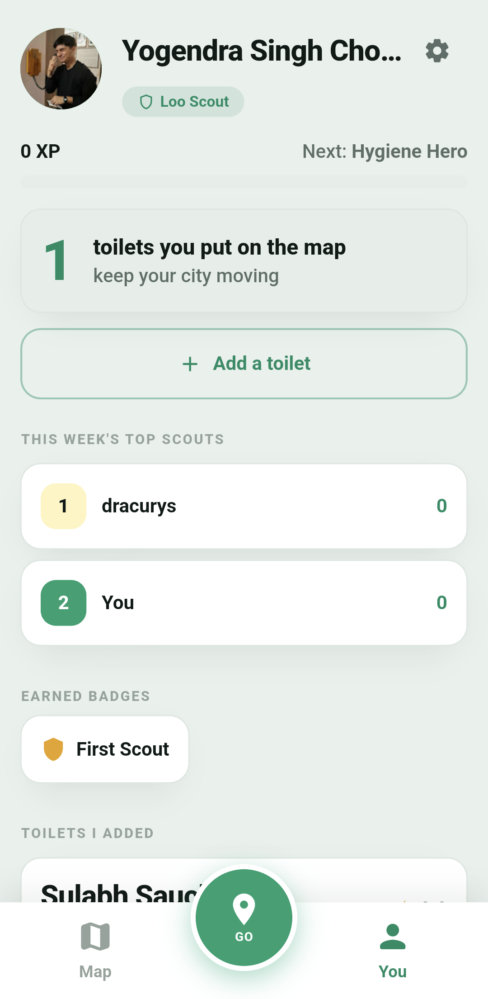

<h1 align="center">ShauchMap — शौच Map</h1>

<p align="center">
  <b>Find the nearest open, community-verified public toilet in India — and get there in one tap.</b>
  <br />
  <sub>Physics before the formula. Freedom of movement, without fear.</sub>
</p>

<p align="center">
  <a href="https://github.com/YoDevStudio/ShauchMap/actions"></a>
  
  
  
  <a href="LICENSE"></a>
  <a href="https://github.com/YoDevStudio/ShauchMap/releases"></a>
</p>

<h1 align="center">ShauchMap — शौच Map</h1>

<p align="center">
  <b>Find the nearest open, community-verified public toilet in India — and get there in one tap.</b>
  <br />
  <sub>Physics before the formula. Freedom of movement, without fear.</sub>
</p>

<p align="center">
  <a href="#-why-shauchmap">Why</a> ·
  <a href="#-features">Features</a> ·
  <a href="#-screenshots">Screenshots</a> ·
  <a href="#-the-scout-system">Scouts</a> ·
  <a href="#-tech-stack">Tech</a> ·
  <a href="#-architecture">Architecture</a> ·
  <a href="#-getting-started">Get started</a> ·
  <a href="#-permissions">Permissions</a> ·
  <a href="#-roadmap">Roadmap</a> ·
  <a href="#-contributing">Contribute</a>
</p>

<br />

> **⚡ The one thing to know:** press **GO** from anywhere in the app. ShauchMap finds the nearest *usable* toilet right now, previews it on a mini-map with the walking time, and hands you off to Google Maps. One tap to the answer, one more to the directions.

<!-- Replace with a real recording: docs/media/go-flow.mp4 -->
<p align="center">
  
</p>

---

## 💚 Why ShauchMap

Finding a public toilet you can actually *use* in an Indian city is harder than it should be. Regular maps might show a pin — but not whether it's **open right now**, whether it has **water**, whether it's **free**, or whether it's **safe for women**. When you need one, you need it fast, and you need to trust it.

ShauchMap answers exactly that question: **where is the nearest toilet I can use, right now?** It's built on 7,741 toilets seeded from OpenStreetMap and kept honest by the people who use them — every check-in, rating, and freshness signal makes the next person's answer better.

- 🎯 **Answer-first, not catalogue-first.** The app leads with *the* nearest usable toilet, not a wall of pins.
- 🤝 **Community-verified.** Real check-ins and ratings, with freshness ("checked 2h ago") so you know it's current.
- ♿ **Honest & inclusive.** Colour-blind-safe status (dot + word + icon, never colour alone), women-safe flags, accessibility tags.
- 📴 **Works when the network doesn't.** Offline caching and a home-screen widget for the nearest loo.

---

## ✨ Features

<table>
<tr>
<td width="50%" valign="top">

### ⚡ The GO button
One button, reachable from every tab. Tap it and ShauchMap resolves your location, finds the nearest **open** toilet, shows it on a mini-map with distance and walk time, and hands off to Google Maps.

### 🗺️ Map-first, orientation-first
A full-bleed map that orients you — *which way, how far* — with live clustering over 7,741 toilets instead of a mess of loose pins. Floating search, quick filter chips, and a tall "nearest open toilet" peek card.

### 🔎 Filters that matter
**Open now · Free · Has water · Western · Women-safe** — the things that actually decide whether a toilet is usable for *you*.

</td>
<td width="50%" valign="top">

### 🛡️ Trust signals
Community check-ins, star ratings, and freshness decay so stale data fades. Bayesian/Wilson scoring keeps ratings fair, and likely-spam entries are hidden.

### 🎖️ The Scout system
Turn civic contribution into a game. Earn XP for adding and verifying toilets, climb the ranks, and top the weekly leaderboard.

### ➕ Contribute in under a minute
Long-press **GO** (or tap **Add** on your profile), drop a pin, tag what's there, done. Only the location is required — skip anything you don't know.

</td>
</tr>
</table>

<details>
<summary><b>More under the hood</b></summary>

- **Home-screen widget** — the nearest open toilet, refreshed in the background via WorkManager.
- **Deep links** — `shauchmap://emergency` (nearest-loo flow) and `shauchmap://navigate?toiletId=…`.
- **Custom haptics** — a tuned feedback channel for taps, toggles, and success.
- **Crash reporting** — Firebase Crashlytics wired for both Flutter and async errors.
- **A real design system** — layered neutral elevation, semantic status tones, tabular hero numbers, and a token layer (`context.sm.*`) that drives every screen.

</details>

---

## 📱 Screenshots

<p align="center">
  
  
  
</p>
<p align="center">
  
  
  
</p>

> _Add short screen recordings to `docs/media/` and embed them here — e.g. `go-flow.mp4`, `browse.mp4`, `add-toilet.mp4`. GitHub plays MP4s inline._

---

## 🎖️ The Scout system

Every contribution is civic data that helps the next person. ShauchMap rewards it.

| Action | Reward |
| :--- | :---: |
| ➕ Add a toilet | **+50 XP** |
| ✅ Quick status check | **+15 XP** |
| ⭐ Rate a toilet | **+10 XP** |

**Ranks:** Loo Scout `0–99` → Hygiene Hero `100–499` → City Guardian `500–999` → Swachh Legend `1000+`

Verify a toilet five times and you become a **Warden** for it. Women-safe flags expire after 24h so they stay current; repeated reports auto-flag bad entries for review. A weekly leaderboard on your profile keeps it friendly.

---

## 🧱 Tech stack

| Layer | Tech |
| :--- | :--- |
| **Framework** | Flutter · Dart 3 |
| **Backend** | Firebase — Auth (Google Sign-In) · Cloud Firestore · Crashlytics |
| **Maps & geo** | Google Maps SDK · `geoflutterfire_plus` (geohash queries) · Geolocator · Geocoding · Flutter Compass |
| **Platform** | WorkManager (background sync) · `home_widget` · `app_links` (deep links) · `flutter_local_notifications` |
| **State & storage** | `shared_preferences` · offline Firestore persistence |
| **Design** | Custom design-token system · `shimmer` skeletons · tuned haptics channel |

---

## 🏗️ Architecture

ShauchMap keeps a strict split between a **presentation layer** (a token-driven design system) and a **logic layer** that's small, tested, and reused everywhere.

- **Design tokens** (`lib/theme/`) — colours, type, spacing, shadows, and reusable components accessed via `context.sm.<token>`. Screens compose tokens; they never hardcode values. Light is the default theme (tuned for outdoor sun); dark is fully supported.
- **Geo queries** — toilets are indexed by geohash and fetched with `geoflutterfire_plus` bounded to a radius around the user, so the app never pulls all 7,741 records at once.
- **The GO flow** — a single entry point resolves GPS (with a cold-start safety gate), finds the nearest open toilet, previews it, and deep-links to Google Maps rather than reinventing turn-by-turn.

```
lib/
├── screens/     # Map, GO, Detail, Browse, Add wizard, You, Onboarding
├── theme/       # Design tokens + reusable SmWidgets
├── services/    # Firestore, haptics, notifications, orientation
├── logic/       # Trust/rating math (Bayesian, Wilson, freshness)
├── widgets/     # Shared UI (states, bouncy tap, …)
└── utils/       # Map launcher, helpers
```

---

## 🚀 Getting started

### Option A — just use it
Grab the latest signed APK from the [**Releases**](https://github.com/YoDevStudio/ShauchMap/releases) page and install it on any Android device.

### Option B — build it yourself

```bash
# 1. Clone
git clone https://github.com/YoDevStudio/ShauchMap.git
cd ShauchMap

# 2. Install deps
flutter pub get

# 3. Provide your own keys (never commit them — see below)
cp .env.example .env   # then fill in your values

# 4. Run with your Places API key injected at build time
flutter run --dart-define=PLACES_API_KEY=your_key_here
```

**You must provide your own keys.** This repo ships **no** secrets. You'll need:
- A **Firebase** project (`flutterfire configure` generates `firebase_options.dart` and the Android config).
- A **Google Maps / Places** API key (injected via `--dart-define=PLACES_API_KEY=…`, never hardcoded).

> ⚠️ **Forking?** Read [`SECURITY.md`](SECURITY.md). If you ship a build, use *your own* restricted keys and keystore. Do not reuse anyone else's.

---

## 🔐 Permissions

ShauchMap asks only for what it needs, and tells you why.

| Permission | Why |
| :--- | :--- |
| **Location** | To find toilets near you and show your position on the map. Never sold, never shared. |
| **Internet** | To load the map and sync community data. |
| **Camera** | Reserved for photo contributions (arriving in v1.1). |
| **Notifications** | Optional nudges to rate a toilet after you visit. |

---

## 🗺️ Roadmap

- [ ] 📷 Photos on toilets (the slot is already reserved in the Add flow)
- [ ] 🇮🇳 Hindi & regional localization (English-only in v1.0)
- [ ] 🔎 Dedicated area/landmark search screen
- [ ] 📈 "People helped" impact metric on your profile
- [ ] 🍎 iOS build

See [open issues](https://github.com/YoDevStudio/ShauchMap/issues) and [discussions](https://github.com/YoDevStudio/ShauchMap/discussions) for what's being worked on.

---

## 🤝 Contributing

Two ways to help, both valuable:

1. **Add toilet data.** The most useful thing you can do — open the app, add or verify toilets in your city.
2. **Contribute code.** Read [`CONTRIBUTING.md`](CONTRIBUTING.md), pick an issue, and open a PR. First-timers welcome.

By participating you agree to our [Code of Conduct](CODE_OF_CONDUCT.md).

---

## 📄 License

[MIT](LICENSE) © [YoDevStudio](https://github.com/YoDevStudio). Use it, learn from it, build on it.

<p align="center"><sub>Built with 💚 in Jodhpur, Rajasthan — so no one has to search when it matters most.</sub></p>
