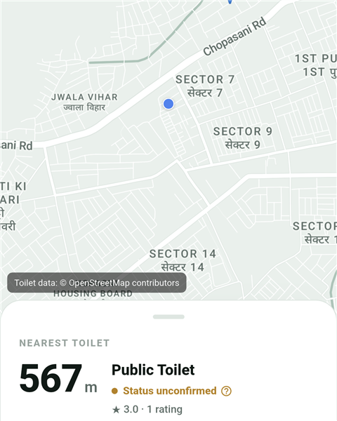
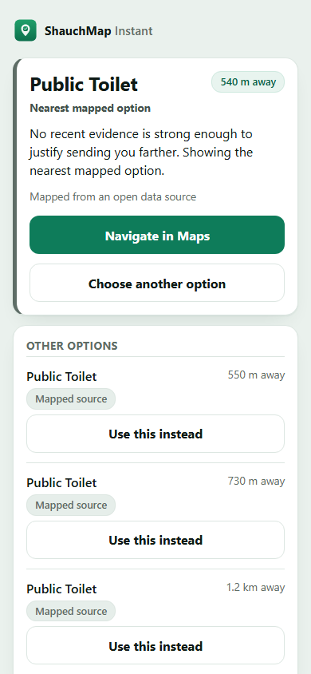

<p align="center">
  <a href="https://github.com/YoDevStudio/ShauchMap/actions"></a>
  <a href="LICENSE"></a>
  <a href="https://github.com/YoDevStudio/ShauchMap/releases"></a>
</p>

<h1 align="center">ShauchMap — शौच Map</h1>

<p align="center"><b>A PIN IS NOT A PROMISE.</b></p>

<p align="center">
  A map can show where a toilet is listed. ShauchMap separates mapped facilities
  from time-bounded condition evidence: strong, fresh evidence can shape the
  recommendation, and where it's absent, ShauchMap falls back to the nearest
  mapped option and says so — <b>Unknown</b> stays <b>Unknown</b>, never a guess.
</p>

<p align="center">
  <a href="https://shauchmap.web.app">Try ShauchMap Instant</a> ·
  <a href="https://github.com/YoDevStudio/ShauchMap/releases">Download Android</a> ·
  <a href="#how-shauchmap-is-different">How it works</a>
</p>

<p align="center">
  
  
</p>
<p align="center"><sub>Real production data, both surfaces. One decision model. Two access surfaces.</sub></p>

---

## The problem

A map pin can show where a toilet is listed. The pin by itself does not establish whether the facility is open, has water, or is usable right now. Most apps quietly treat "it's on the map" as if it meant "it's usable." For a public toilet, that gap is the whole problem.

## How ShauchMap is different

ShauchMap separates three things that most apps blur into one — **Truth** (what's mapped), **Evidence** (what's actually known about current condition, and how fresh it is), and **GO** (one bounded decision policy over the full nearby candidate set, with a stated reason, never a guess dressed up as certainty). Ratings and votes are opinion signals with zero say in that decision; only time-bounded condition observations (open / water / usable / lock) carry current-condition authority, and they expire. Where the evidence is thin, ShauchMap says **Unknown** instead of inferring a status from the mapped record alone. Read the full model: [docs/truth-evidence-go.md](docs/truth-evidence-go.md).

## Live products

| | |
| :-- | :-- |
| **Android** | The native client — Google Sign-In, condition checks (the current-condition path), ratings and check-ins (opinion/bookkeeping, not condition authority), and the Scout system, all as tightly scoped, individually-owned contributions. [Download the latest release](https://github.com/YoDevStudio/ShauchMap/releases). |
| **[ShauchMap Instant](https://shauchmap.web.app)** | A zero-install, read-only web companion. No account, no writes, no analytics, foreground location only (with your permission — GO needs it to find anything nearby). Built for the "I need one right now" case — a QR code, a shared link. See [docs/instant.md](docs/instant.md). |

One shared decision core ([`packages/shauchmap_core`](packages/shauchmap_core)). Two access surfaces.

## Current production reality

ShauchMap's production database currently holds approximately **7,741 toilet facility records**, mostly seeded from OpenStreetMap. They are *mapped*, not individually field-verified as a corpus — a pin means a facility was mapped; it does not by itself mean the facility is currently usable.

Current-condition evidence is tracked entirely separately from the mapped record. **Ratings are opinion only** and **votes are opinion only** — neither carries any current-condition authority. The only current-condition authority is a **time-bounded condition observation** (open / water / usable / lock, each a plain yes/no/unknown tally with a strict-majority verdict), and it **expires** — once its validity window passes, it reverts to Unknown rather than lingering as stale-but-trusted data. For most facilities today, that condition evidence is sparse, and ShauchMap says **Unknown** rather than inferring a status from the mapped record alone. Where strong, fresh condition evidence isn't available for anywhere nearby, ShauchMap still returns its nearest mapped option and says plainly that it's doing so, rather than fabricating a confidence it doesn't have.

## Architecture

Shared Truth/Evidence/GO logic in a single, independently-tested Dart package, consumed by both clients. Android is an authenticated contribution surface with tightly scoped, individually-owned writes — creating a new toilet record is currently denied server-side for every client, pending a minimum-supported-version enforcement mechanism (see [SECURITY.md](SECURITY.md) and `firestore.rules`). See [docs/architecture.md](docs/architecture.md) for the full diagram and layout.

## Field validation

A local, offline-first tool inside the Android app supports structured ground inspection of real facilities — separate from, and not a shortcut into, the consumer Evidence pipeline. The tooling and schema are ready; physical field collection has not yet been completed. See [docs/field-audit-method.md](docs/field-audit-method.md).

## Quality / testing

Each layer is tested independently and the suites are real, not aspirational: the shared core (`dart test`), the Android app (`flutter test`), Instant (`vitest`), Firestore rules (an emulator-based allow/deny matrix), Cloud Functions (unit + emulator), and a native-Dart-vs-compiled-JS conformance check. All of it runs on every pull request in CI without needing production credentials — see [.github/workflows/ci.yml](.github/workflows/ci.yml).

## Privacy / security

See [PRIVACY.md](PRIVACY.md) and [SECURITY.md](SECURITY.md) — both cover Android and Instant, and both say plainly what is and isn't a secret rather than making blanket claims.

## Development

The fastest way to run something from a clean clone needs no secrets at all — ShauchMap Instant in fixture mode:

```bash
git clone https://github.com/YoDevStudio/ShauchMap.git
cd ShauchMap/instant
npm ci
npm run dev              # fixture mode — no Firebase project needed
```

The Android app needs your own Firebase project and your own Google Maps SDK key — this repo ships no secrets and none should ever be committed. Full setup for both surfaces, plus Firestore rules/Cloud Functions, is in [CONTRIBUTING.md](CONTRIBUTING.md).

## Known limitations

- Most of the ~7,741 seeded toilet locations have no community condition evidence attached yet — expected, and disclosed rather than hidden.
- Creating a new toilet record (Add-Toilet) is currently denied server-side for every client, pending a minimum-supported-version enforcement mechanism.
- Search finds toilets already loaded into the app by name or address; there is no general city/area lookup.
- Native client currently targets Android.

## Data sources / attribution

Toilet location data includes **© OpenStreetMap contributors**, available under the Open Database License. See [docs/data-sources.md](docs/data-sources.md) for the full attribution and what this repository does and doesn't distribute.

## Contributing

Two ways to help: report a stable data problem (wrong location, duplicate, a facility that's permanently gone) via the [data report issue template](https://github.com/YoDevStudio/ShauchMap/issues/new?template=toilet_data.yml), or contribute code. GitHub Issues are not a live current-condition channel — see [CONTRIBUTING.md](CONTRIBUTING.md) for the distinction and the full contributor path. By participating you agree to our [Code of Conduct](CODE_OF_CONDUCT.md).

## License

[MIT](LICENSE) © [YoDevStudio](https://github.com/YoDevStudio).

<p align="center"><sub>Built in Jodhpur, Rajasthan.</sub></p>
