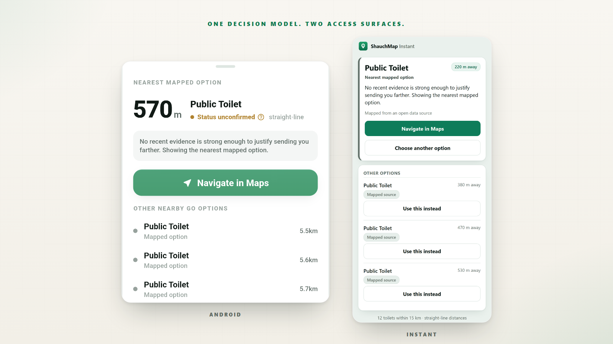
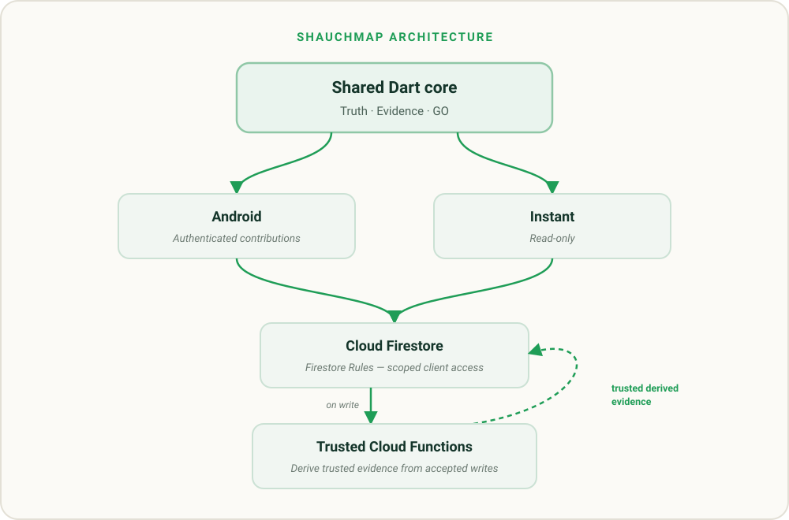

# ShauchMap

**A PIN IS NOT A PROMISE.**

Find a nearby mapped public toilet without pretending unknown conditions are known.

[Try ShauchMap Instant](https://shauchmap.web.app) &nbsp;·&nbsp; [Download Android](https://github.com/YoDevStudio/ShauchMap/releases/latest) &nbsp;·&nbsp; [How it works](#mapped-evidence-and-go)



[](https://github.com/YoDevStudio/ShauchMap/actions/workflows/ci.yml)
&nbsp;
[](LICENSE)
&nbsp;
[](https://github.com/YoDevStudio/ShauchMap/releases/latest)

---

## A map pin isn't enough

A map can tell you that a toilet is listed. It cannot, by itself, establish whether that facility is open, has water, or is usable right now.

ShauchMap keeps mapped facility information separate from current-condition evidence, then makes an explainable nearby decision without turning missing information into certainty.

## Mapped, Evidence and GO

| Mapped | Evidence | GO |
| --- | --- | --- |
| Where a facility is listed | What is currently known | What ShauchMap recommends |
| Primarily open-data sourced | Time-bounded Condition Checks | One explainable nearby decision |
| Does not imply usable now | Expires back to Unknown | Says Unknown when unsupported |

Ratings and votes remain opinion signals; they do not establish current condition.

Full model: [docs/truth-evidence-go.md](docs/truth-evidence-go.md).

## One decision model. Two access surfaces.

| Android | ShauchMap Instant |
| --- | --- |
| Native client for GO, Condition Checks, ratings and other scoped contributions | Zero-install, read-only web access |
| Google Sign-In | No account |
| Google Maps navigation hand-off | No contribution writes |
| Full contribution surface | Built for immediate access |

Both consume the same shared Truth / Evidence / GO core.

## Production reality

**≈7,741 mapped facility records**

The production catalogue is mostly seeded from OpenStreetMap. These are mapped records, not 7,741 individually field-verified toilets.

Fresh current-condition evidence is still sparse today. Where current condition cannot be established, ShauchMap shows **Unknown** instead of inferring a status from the map record.

- **Ratings:** opinion only
- **Votes:** opinion only
- **Condition Checks:** time-bounded current-condition authority
- **Add Toilet:** currently disabled for top-level creation

## Architecture



ShauchMap's decision policy lives in one independently tested Dart package consumed by Android and Instant. Firestore Rules constrain client access; Cloud Functions maintain trusted derived evidence.

[Architecture](docs/architecture.md) &nbsp;·&nbsp; [Truth / Evidence / GO](docs/truth-evidence-go.md) &nbsp;·&nbsp; [Security](SECURITY.md)

## Quality & safety

| Layer | Checks |
| --- | --- |
| Shared core | Dart analyze + tests |
| Android | Flutter analyze + tests |
| Instant | Typecheck + lint + tests + build |
| Cross-runtime core | Native Dart ↔ compiled-JS oracle |
| Firestore Rules | Emulator allow/deny matrix |
| Cloud Functions | Unit + emulator tests |

All six CI jobs currently pass on clean GitHub runners.

## Field validation

ShauchMap includes a local, offline-first Field Audit tool for structured ground inspection. The tooling and schema are ready; physical collection is the next validation step.

[docs/field-audit-method.md](docs/field-audit-method.md)

## Run locally

```bash
git clone https://github.com/YoDevStudio/ShauchMap.git
cd ShauchMap/instant
npm ci
npm run dev
```

Instant fixture mode requires no Firebase project. Android setup and backend development are documented in CONTRIBUTING.md.

## Documentation

| Resource | Link |
| --- | --- |
| Architecture | [docs/architecture.md](docs/architecture.md) |
| Truth / Evidence / GO | [docs/truth-evidence-go.md](docs/truth-evidence-go.md) |
| ShauchMap Instant | [docs/instant.md](docs/instant.md) |
| Field validation | [docs/field-audit-method.md](docs/field-audit-method.md) |
| Privacy | [PRIVACY.md](PRIVACY.md) |
| Security | [SECURITY.md](SECURITY.md) |
| Contributing | [CONTRIBUTING.md](CONTRIBUTING.md) |
| Data sources | [docs/data-sources.md](docs/data-sources.md) |

## Data & license

Toilet location data includes **© OpenStreetMap contributors** and is used under the Open Database License. ShauchMap source code is licensed under **MIT**.

**Built by YoDevStudio in Jodhpur, Rajasthan.**
